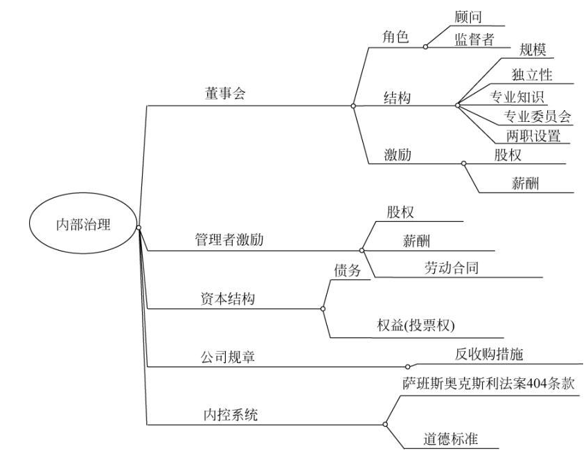

## 公司治理的范畴
李维安的[《公司治理手册》](https://item.jd.com/11768176.html?cu=true)内容较为全面，基本可以囊括各方面内容。包括：一般公司治理、股东治理、董事会治理、监事会治理、经理层治理、外部治理、新型组织治理、金融机构治理、中国公司治理、公司治理绩效、公司治理事件、公司治理法律政策和法规。

比如，马连福等著的[《公司治理（第2版)](https://item.jd.com/12795318.html?cu=true)包括：公司治理基础、公司股权结构设计、董事会运作机制设计、监事会监督机制设计、高级管理者激励机制设计、公司治理模式选择、信息披露治理、公司治理评价。

郎咸平[《公司治理：郎咸平学术文集》](https://item.jd.com/11467750.html?cu=true)的主要内容为股利政策、公司长期债政策、破产与重组、兼并与收购、公司的多元化经营与投资策略的分析、股权结构的分析、金融市场的定价和特性。

市面上公司治理的培训课程华师经纪基本都有。包括：

温茗老师的[《企业治理和内控管理》](http://www.huashijingji.com/course_details?courseid=25707)、吴梓境老师的[《股权结构设计与股权激励》](http://www.huashijingji.com/course_details?courseid=5675#anchor_2)、张小明老师的[《公司治理中股东董事监事运行规范》](http://www.huashijingji.com/course_details?courseid=13528)、

图片出处是2006年的一篇文献综述Recent Developments in Corporate Governance:
An Overview（ [文件下载](files/gillan2006.pdf) ）

[关于发布《上市公司高级管理人员培训工作指引》及相关实施细则的通知](http://www.csrc.gov.cn/pub/newsite/flb/flfg/bmgf/ssgs/gszl/201012/t20101231_189742.html)

### 内训课程

吴梓境老师的[《股权结构设计与股权激励》](http://www.huashijingji.com/course_details?courseid=5675)、

## 专业自媒体运营

### 春晖投行在线

基本上就是上两三天课，进行一年的在线学习。

沈春晖，红塔证券副总裁兼投资银行事业总部总经理。个人网站[春晖投行在线](http://www.shenchunhui.com/)著名投行网站。

[知室 (g2s.cn)](https://www.g2s.cn/)

之前找的讲华为狼性营销的许浩明老师的[智谋帮](http://www.zmbthink.com/gywm)、之前公司银行业务经纪推荐的[陈盛东金融工作室](http://chenshengdong.net/)

高维学堂

